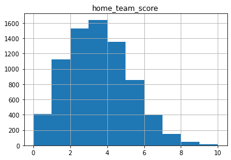
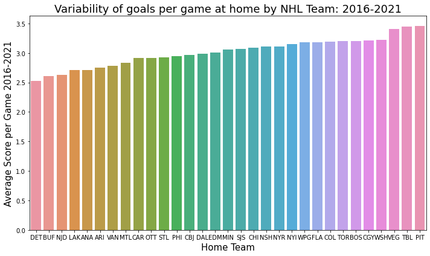
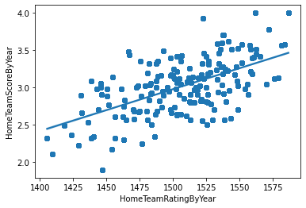
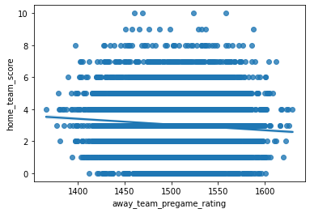
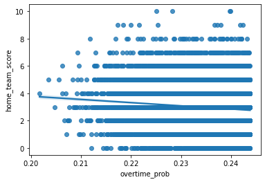

# Machine-Learning-Final-Project----Mattingly-Michael
Final project for CMSCI 4200

This is the final project for CMPSCI4200.  

## Data Discussion
[The data being used for this project comes from fivethirtyeight.com](https://github.com/fivethirtyeight/data/tree/master/nhl-forecasts)

In order to draw reasonable conclusions from the data, some assumptions need to be made.
First, the data needs to be restricted to complete seasons with each current team equally represented.
For this the data is filtered to the NHL seasons 2016-2021
A future consideration will be excluding the 2021 season due to the COVID-19 pandemic since games were not played in all NHL stadiums.

## Now let's look at a correlation heat map to see the overall correlation between variables in the dataset.

### Here is a distribution of our proposed target variable: home_team_score

We see home_team_score seems to follow a normal distribution which satisfies a requrirement for regression and suggests no transformation is needed.

### Home team score varies by team from 2016-2021 

The vertical bar chart illustrates variability in the goals per game scored by team.

### The correlation heat map shows some correlation between home_team_pregame_rating and the home_team_score but let's look closer...
If we look at the mean home_team_pregame_rating with the mean home_team_score in the data we see a clear direct linear relationship

We also note a simple non-aggregated view of away team pre game rating is indirectly related with home team score.

### Home team score also seems to decrease slightly as the probability of Overtime increases

