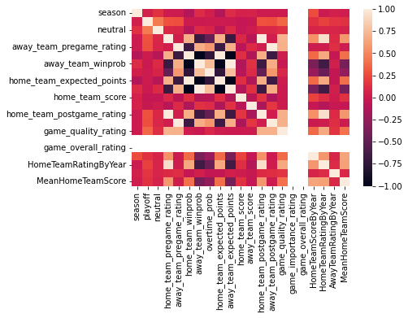

# Machine-Learning-Final-Project----Mattingly-Michael
Final project for CMSCI 4200

This is the final project for CMPSCI4200.  

## Data Discussion
[The data being used for this project comes from fivethirtyeight.com](https://github.com/fivethirtyeight/data/tree/master/nhl-forecasts)

In order to draw reasonable conclusions from the data, some assumptions need to be made.
First, the data needs to be restricted to complete seasons with each current team equally represented.
For this the data is filtered to the NHL seasons 2016-2021
A future consideration will be excluding the 2021 season due to the COVID-19 pandemic since games were not played in all NHL stadiums.

## Now let's look at a correlation heat map to see the overall correlation between variables in the dataset.

