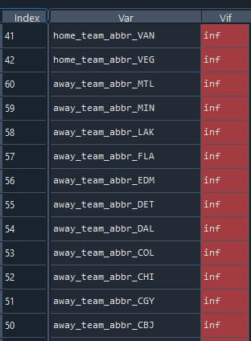

# Machine-Learning-Final-Project----Mattingly-Michael
This is the final project for CMPSCI4200.  

# Part 1

## Data Discussion
### Here is the link to the Data
[The data being used for this project comes from fivethirtyeight.com](https://github.com/fivethirtyeight/data/tree/master/nhl-forecasts)

In order to draw reasonable conclusions from the data, some assumptions need to be made.
First, the data needs to be restricted to complete seasons with each current team equally represented.
For this the data is filtered to the NHL seasons 2016-2021
A future consideration will be excluding the 2021 season due to the COVID-19 pandemic since games were not played in all NHL stadiums.

## Now let's look at a correlation heat map to see the overall correlation between variables in the dataset.

### Here is a distribution of our proposed target variable: home_team_score

We see home_team_score seems to follow a normal distribution which satisfies a requrirement for regression and suggests no transformation is needed.

### Home team score varies by team from 2016-2021 

The vertical bar chart illustrates variability in the goals per game scored by team.

### The correlation heat map shows some correlation between home_team_pregame_rating and the home_team_score but let's look closer...
If we look at the mean home_team_pregame_rating with the mean home_team_score in the data we see a clear direct linear relationship

We also note a simple non-aggregated view of away team pre game rating is indirectly related with home team score.

### Home team score also seems to decrease slightly as the probability of Overtime increases

### Home team score also seems to decrease slightly during a playoff game

### Prediction strategy
Based on the initial analysis we can see from the histogram of home_team_score that the target variable (home_team_score) appears to be normally distributed.
We will apply regression to predict the number of goals the home team will score based on home_team_pregame_rating, away_team_pregame_rating, 
who the home team is, who the opponent is, if the game is a playoff game, and if overtime is probable. 

The data will be scaled given the order of magnitude difference between home and away team ratings and other variables.
Character variables for home and away teams will be recoded using dummy or one hot encoding.

Our strategy will be split the data randomly between train and test to ensure we do overfit the mddel.

Finally, additional predictive features to explore (time permitting) will be moving averages and lag variables for goals per game and prior game goals scored.

# Part 2 Regression Problem

## 1 Distribution of terget values
### Here is a distribution the target variable: home_team_score (goals scored by the home team)

## home_team_score is normally distributed, with a mean of 3.02 goals/game and is range-bounded between 0 and 10.

## 2 Here we use isnull().any on our dataframe, and there are no NA or missing values.

## 3 Initiallly we decided to keep overtime and team abbreviation and dummy coded since the values are ordinal not hierarchical.
These variables showed correlation with the target variable and varied by home and away team.
Ultimately, we dropped home and away team abbreviation due to multicolinearity (see Inf VIF below) with home and away pregame rating
Kept ot (Overtime indicator), dummy coded, and cacluated lag count of ot games in last 3 games 
The rationale behind this is consecutive over time games take up a lot of energy and can reduce effort and lead to lower scoring games 

## Aggregation Columns
Three aggregation columns were created.
3 game moving average of home goals scored.
3 game standard deviation of home goals scored.
3 game home team pre-game rating
3 game over-time count

The variables were set up with a 1 game shift so the most recent 3 prior games would be an input to the current game. Missing values were mean filled.

## Function for spliting and testing different models
Since we want to run scenarios with different train and test splits and different models, a function was defined to promote code efficiency to run the code with varying these paramters.
The function thats take 2 paramters:
1 for test_size to split between test and train 
1 for regression model algorithm
And implements a Standard Scaler
The function returns the model accuracy for the given split and model

## Model Training
Since regression was the approach, we used regression and SGDRegressor.

## Post Model Analysis
The model performance was evaluated using model.score on test samples to get idea of accuracy.
As the print out shows the linear regression model had the highest accuracy with 30% test.

The accuracy of the linear regression model was tested at various levels of splits.
70% train/30% test yielded the highest accuracy.

## Residuals library to plot residuals

## Conclusion
The linear regression with 30% Test provided the highest accuracy at 85%. The SGG regressor achieved an accuracy of 73%

In this case using linear regression outperformed SGD regressor in the test data.
Based on accuracy in the test sample, we would recommend linear regression to predict home team score.

However, 85% accuracy on a mean of 3.02 goals per game translates to about 1/2 a goal error per game.  
Depending on acceptance for risk, we would not reccomend using this model for wagering.
Perhaps with additional data, the accuracy might be improved to accceptable limit.

